# Clay UX & Feature Analysis

**Overall Impression:** 
Clay is a highly flexible, spreadsheet-like data engine on steroids. Instead of a rigid, pre-defined SDR workflow, it acts as a massive integration hub (100+ data providers) where users build "tables" of leads, run granular enrichments (signals, scraping, API calls), and use customizable AI agents ("Claygents") to draft emails. It feels incredibly powerful but requires significant setup and technical understanding to orchestrate.

#### Step 1: Onboarding & Workspace Setup
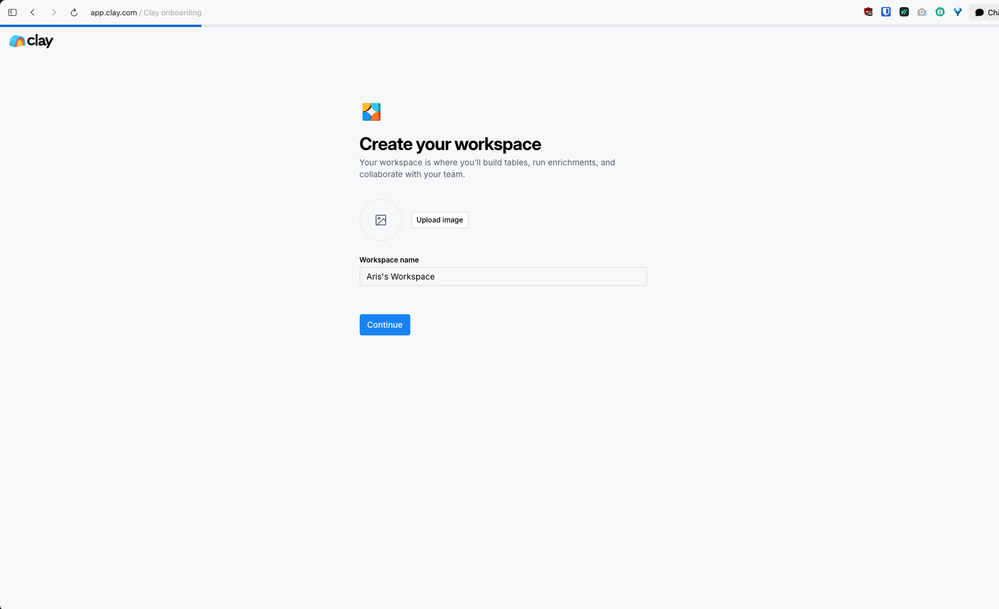
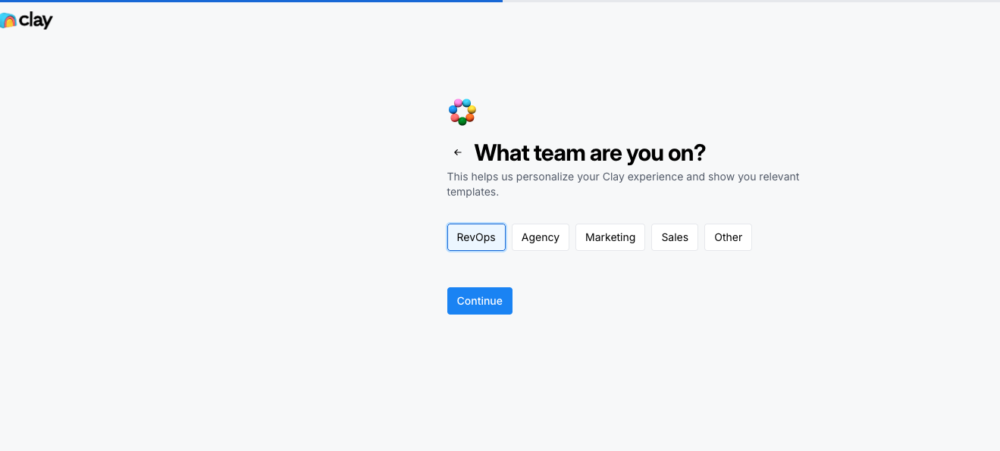
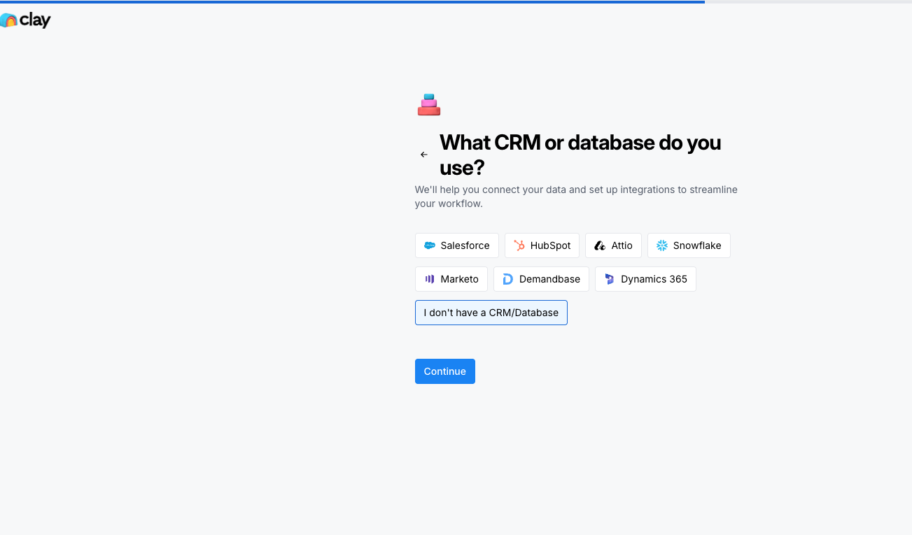
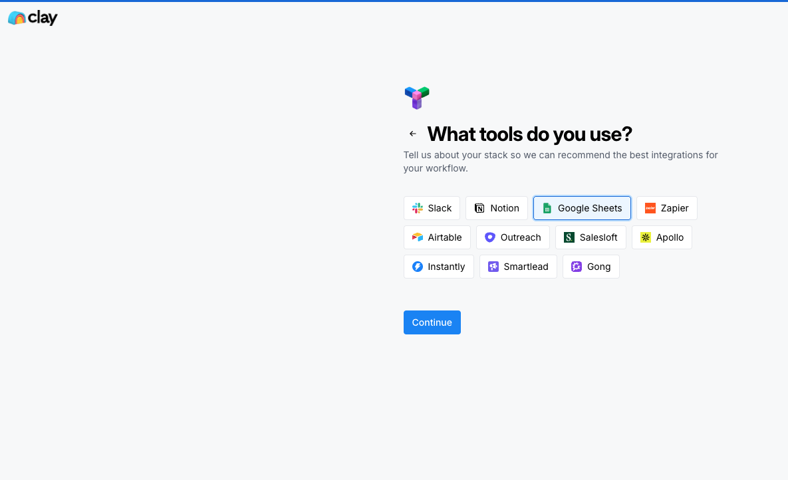
- **What they did well:** 
  - Gathers context immediately (Role, CRM used, Sales stack used) to tailor the workspace integrations.
  - Very clean, step-by-step UI to get the initial connections out of the way.
- **What we are missing / Gaps:** 
  - Our setup is more rigid. We don't dynamically adapt our workflow based on the user's specific tech stack upfront.

#### Step 2: Sourcing & Building the Table
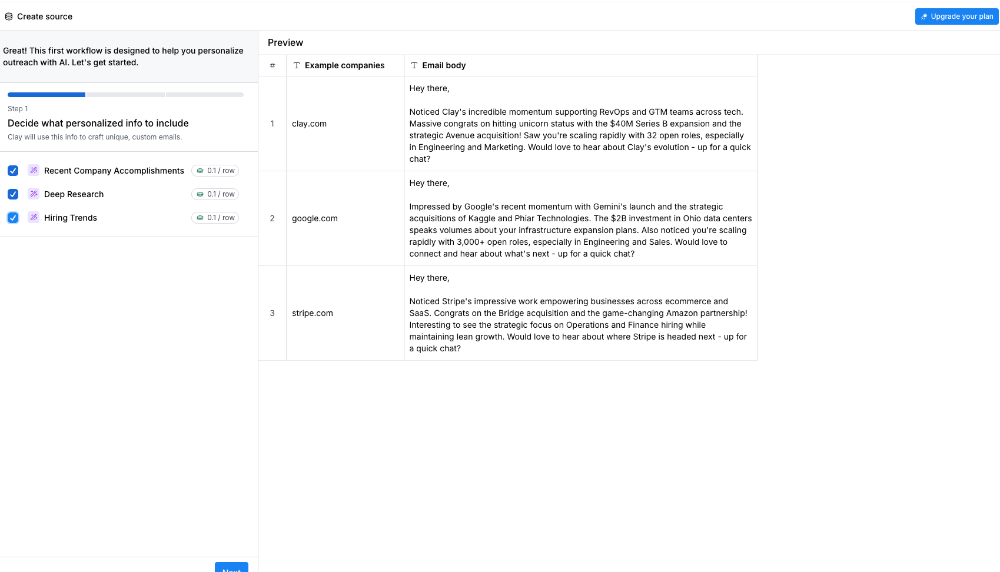
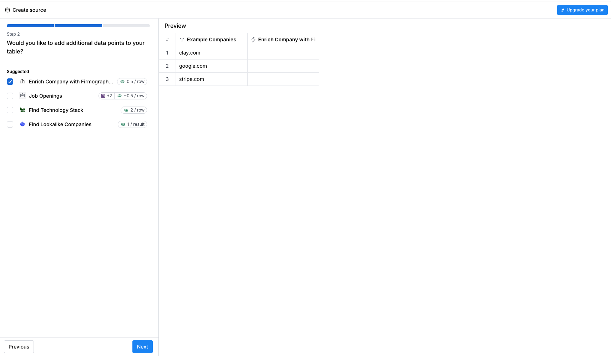
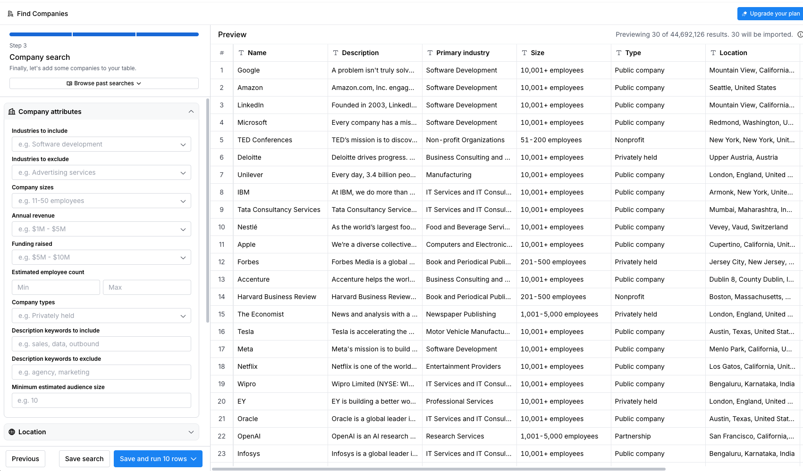
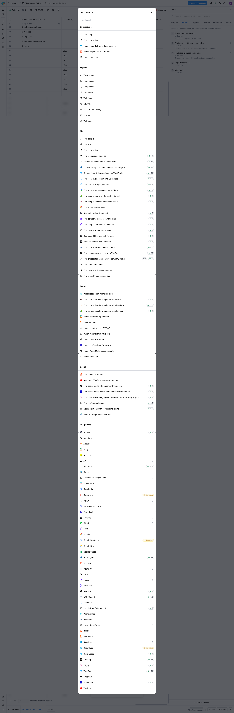
- **What they did well:** 
  - Extremely granular company search (Industries, sizes, revenue, funding).
  - The "Add source" menu (clay_img8) is a masterclass in integration abundance. They offer everything from basic CSVs to Apollo, Bombora intent, Reddit mentions, and custom webhooks.
  - Users can visualize data as a spreadsheet, making it highly transparent.
- **What we are missing / Gaps:** 
  - Project Zebra is a predefined pipeline. Clay allows users to bring their own data from *anywhere*. 

#### Step 3: Enrichment & Signal Monitoring
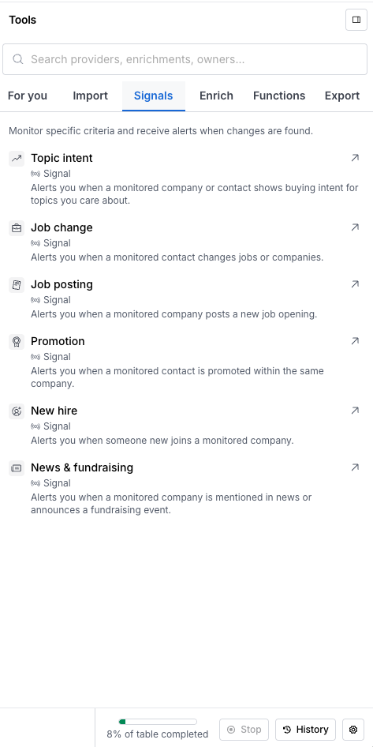
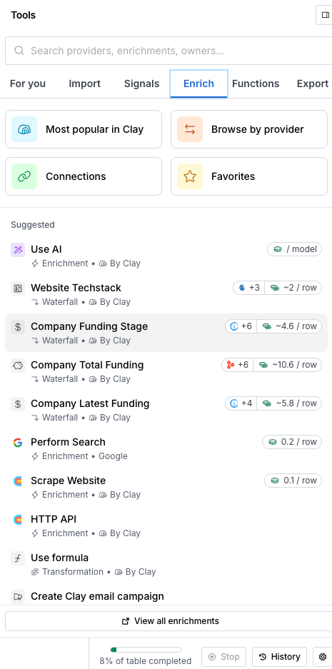
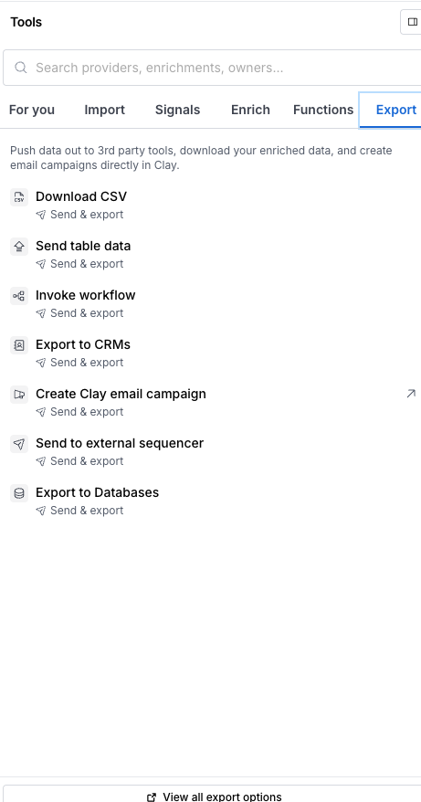
- **What they did well:** 
  - Granular signal monitoring (Job postings, promotions, topic intent).
  - "Waterfall" enrichment (if provider A fails, try provider B).
  - Ability to run custom HTTP APIs or scrape websites directly within the table.
- **What we are missing / Gaps:** 
  - Clay makes "enrichment" a modular marketplace. Our SDR agent currently assumes signals are just handed to it or finds them itself. We lack the visual transparency of showing exactly *what* signals were found for *which* lead in a table format.

#### Step 4: Claygents (AI Agents) & Execution
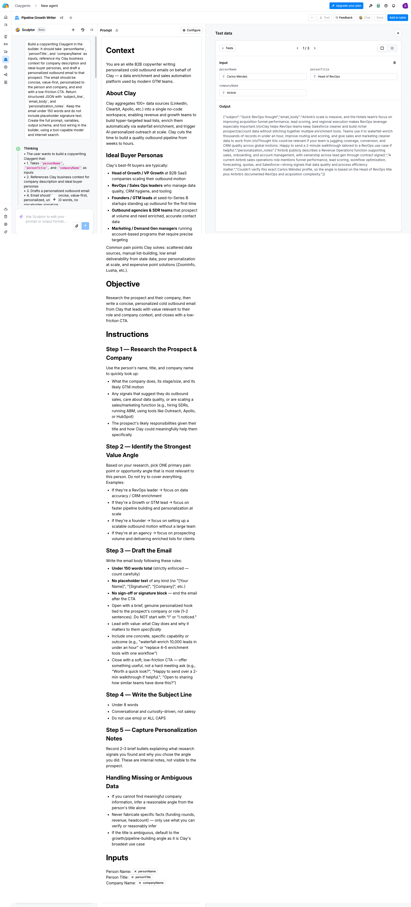
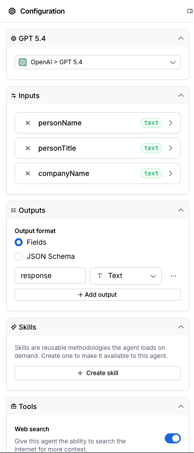
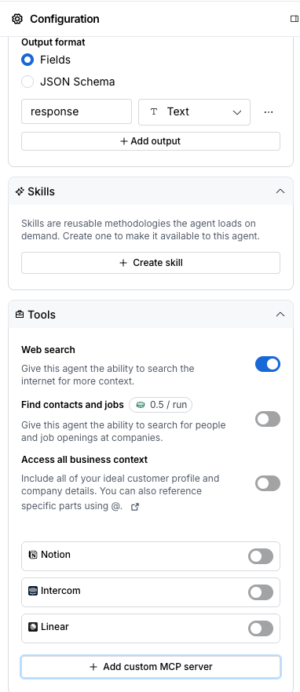
- **What they did well:** 
  - The "Claygent" builder is essentially a prompt IDE. You define the context, objective, and instructions.
  - Inputs map directly to spreadsheet columns (e.g., `personName`, `companyName`).
  - **Massive flex:** Agents can be given specific tools like "Web search", or even connected to internal knowledge via "Add custom MCP server" (Notion, Intercom, etc.).
  - Side-by-side testing of the prompt before running it on the whole table.
- **What we are missing / Gaps:** 
  - Our drafting agent (Stage 7) is hardcoded. Clay allows the user to write the prompt and give the agent specific tools.
  - Clay allows connecting custom MCP servers so the agent can read the user's Notion docs or internal wikis to write better emails. This is a massive feature we should consider adding to Project Zebra.

---

## 📊 Benchmark Summary: What Zebra needs to build

Based on our current architecture (`Current_State_Process_1255PM_Aug22.md`), Clay exposes some major paradigm shifts we should consider adopting to make Project Zebra vastly superior:

1. **The "Leads Table" UI Metaphor:** Instead of treating the SDR workflow as an invisible backend pipeline, we need to build a spreadsheet-like UI. Users should see their leads as rows, and the outputs of our Stages (Research, Scoring, Strategy, Draft) as columns. This provides immense transparency.
2. **Waterfall Enrichment Engine:** We shouldn't rely on a single data source. We need to build a modular enrichment engine (Stage 2/3) that can cascade through providers (e.g., try Provider A for funding news; if null, try Provider B; if null, try Google Search).
3. **The Prompt IDE (Dynamic AI Stages):** Hardcoding the email generation prompt in `stage7-draft.ts` is a mistake. We must build a UI that allows the user to write their own prompt, map variables from the Leads Table (e.g., `{{personName}}`, `{{recent_funding}}`), and test it side-by-side before bulk execution.
4. **Agentic Tooling & MCP Servers:** This is the killer feature. When the AI generates an email, it shouldn't just guess the user's product features. We need to allow users to attach **MCP Servers** (like Notion, Google Drive, or their Help Center) to the drafting agent. This allows the AI to RAG (Retrieve and Generate) specific facts from the user's actual internal company wikis to write hyper-accurate, deeply personalized emails.
5. **Granular Signal Subscriptions:** Instead of just "researching a company", we should allow the user to subscribe to specific signals (Job Changes, Funding, New Hires) and trigger the pipeline automatically when those signals hit.
